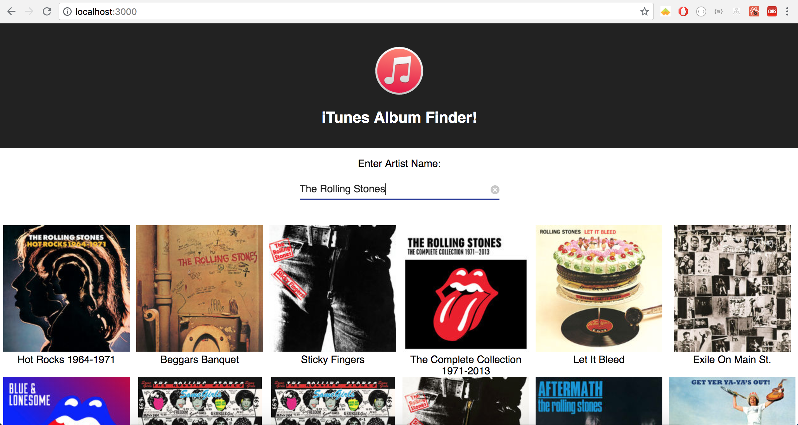

# iTunes Album Finder
## By Ian Knepper

iTunes Album Finder performs Axios requests via the iTunes API and displays albums by artist.
Album grid is responsive to window size.

# To run iTunes Album Finder in your browser:
Install dependencies via npm
```
`npm install`
```
Launch server in your broswer
```
`npm start`
```

Runs the app in the development mode.<br>
Open [http://localhost:3000](http://localhost:3000) to view it in the browser.



## Built With:
* Javascript ES6
* React
* Styled w/ Material UI/ CSS Classes
* Bundling with webpack/ Babel
* Localhost server provided by Create React App

## Authors

* **Ian Knepper** - *Initial work* - (https://github.com/rollaflip)
